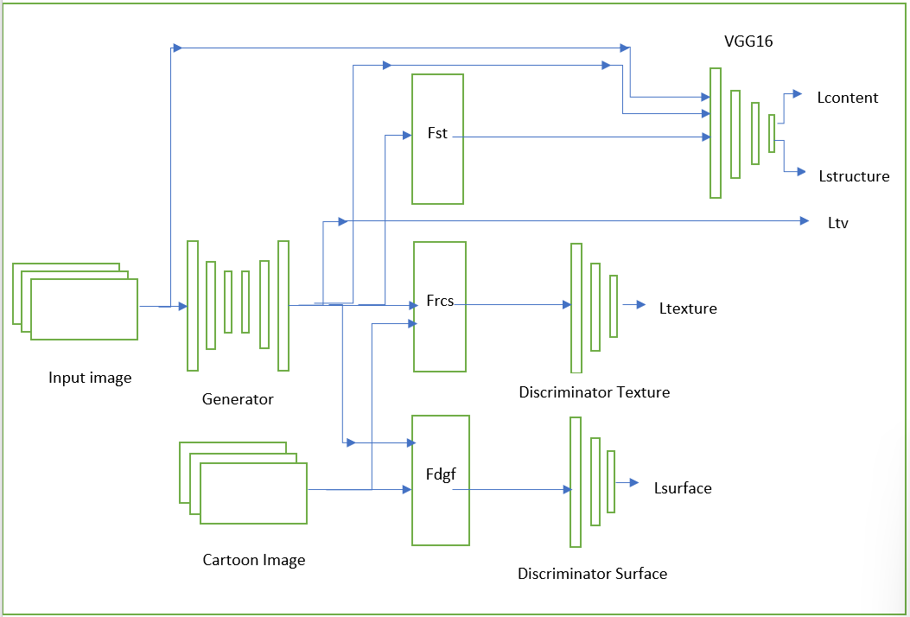
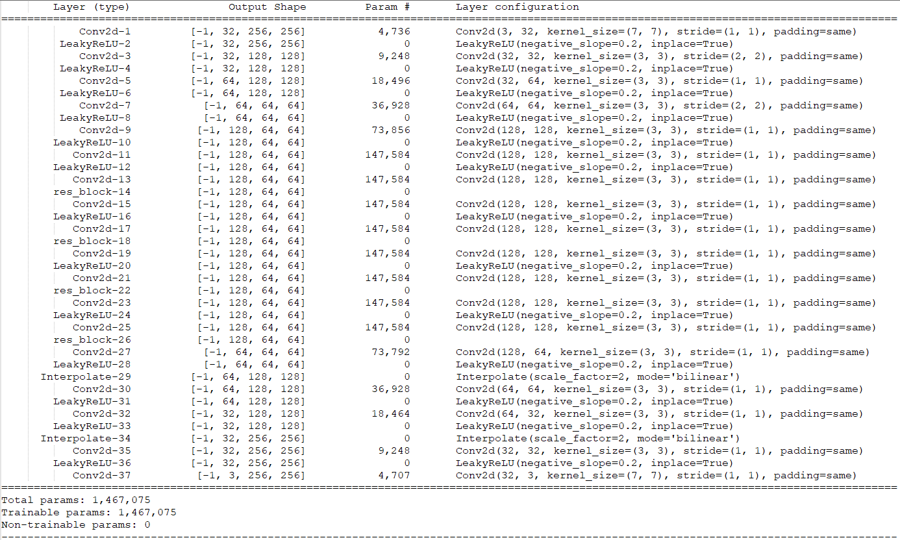

# White Box Cartoonization using Pytorch
Pytorch implementation for CVPR2020 paper “Learning to Cartoonize Using White-box Cartoon Representations”.

# Reference to original paper and code ( Tensorflow V1 ) by the creator
[CVPR2020]Learning to Cartoonize Using White-box Cartoon Representations
[project page](https://systemerrorwang.github.io/White-box-Cartoonization/) |   [paper](https://github.com/SystemErrorWang/White-box-Cartoonization/blob/master/paper/06791.pdf) |   [twitter](https://twitter.com/IlIIlIIIllIllII/status/1243108510423896065) |   [zhihu](https://zhuanlan.zhihu.com/p/117422157) |   [bilibili](https://www.bilibili.com/video/av56708333) |  [facial model](https://github.com/SystemErrorWang/FacialCartoonization)

### Extract below representations from images for learning
1. **Surface representation** 
   - Contains a smooth surface of cartoon images. 
   - Extract a weighted low-frequency component, where the color composition and surface texture are preserved with edges, textures and details ignored. 
   - Motivated by the cartoon painting behavior where artists usually draw composition drafts before the details are retouched. 
   - In this work, we adapt a differentiable guided filter **Fdgf** to extract smooth, cartoon-like surface from images, enabling our model to learn structure-level composition and smooth surface that artists have created in cartoon artworks. 
   - **Loss Function** - Lsurface(G, Ds) = logDs(Fdgf (Ic, Ic)) + log(1 − Ds(Fdgf (G(Ip), G(Ip)))). **Ip** - Input image , **Ic** - Reference Cartoon image , **G** - Generator , **Ds** - Surface Discriminator 
2. **Structure representation** 
    - It refers to the sparse color-blocks and flatten global content in the celluloid style workflow. 
    - Extract a segmentation map from the input image and then apply an adaptive coloring algorithm ( Effectively enhances the contrast of images and reduces hazing effect ) on each segmented regions to generate the structure representation. 
    - Motivated to emulate the celluloid cartoon style, which is featured by clear boundaries and sparse color blocks. Super-pixel segmentation groups spatially connected pixels in an image with similar color or gray level. 
    - In this work, we follow the felzenszwalb algorithm to develop a cartoon-oriented segmentation method to achieve a learnable structure representation. Superpixel algorithms only consider the similarity of pixels and ignore semantic information, we further introduce selective search to merge segmented regions and extract a sparse segmentation map. 
    - **Loss Function** - Lstructure = ||VGGn(G(Ip)) − VGGn(Fst(G(Ip)))||. **Fst** - Structure representation extraction , **Ip** - Input image , **VGGn** - Pretrained VGG16 model , **G** - Generator
3. **Texture representation** 
    - It reflects highfrequency texture, contours, and details in cartoon images.  The input image is converted to a single-channel intensity map , where the color and luminance are removed and relative pixel intensity is preserved. 
    - Motivated by a cartoon painting method where artists firstly draw a line sketch with contours and details, and then apply color on it. 
    - A random color shift algorithm Frcs to extract single-channel texture representation from color images, which retains high-frequency textures and decreases the influence of color and luminance. 
    - **Loss Function** - Ltexture(G, Dt) = logDt(Frcs(Ic)) + log(1 − Dt(Frcs(G(Ip)))). Frcs(Irgb) = (1−α)(β1∗Ir+β2∗Ig+β3∗Ib)+α∗Y. Y - grayscale image converted from RGB color image , **Ip** - Input image , **Ic** - Reference Cartoon image , **G** - Generator , **Dt** - Texture Discriminator

  

### Paper Implementation
- In this paper, we adopt an unpaired image-to-image translation framework for image cartoonization. We decompose images into several representations, which enforces network to learn different features with separate objectives, making the learning process controllable and tunable.
- A GAN framework with a generator G and two discriminators Ds and Dt is proposed, where Ds aims to distinguish between surface representation extracted from model outputs and cartoons, and Dt is used to distinguish between texture representation extracted from outputs and cartoons.
- Pre-trained VGG16 network is used to extract high-level features and to impose spatial constrain on global contents between extracted structure representations and outputs, and also between input photos and outputs. Weight for each component can be adjusted in the loss function, which allows users to control the output style and adapt the model to diverse use cases.
- Loss Functions
  - Lsurface(G, Ds) = logDs(Fdgf (Ic, Ic)) + log(1 − Ds(Fdgf (G(Ip), G(Ip))))
  - Lstructure = ||VGGn(G(Ip)) − VGGn(Fst(G(Ip)))||
  - Ltexture(G, Dt) = logDt(Frcs(Ic)) + log(1 − Dt(Frcs(G(Ip))))
  - Lcontent = ||VGGn(G(Ip)) − VGGn(Ip)|| .The content loss Lcontent is used to ensure that the cartoonized results and input photos are semantically invariant, and the sparsity of L1 norm allows for local features to be cartoonized. Similar to the structure loss, it is calculated on pre-trained VGG16 feature space.
  - Ltv = (1/(H ∗ W ∗ C))*||Delta(G(Ip)) + Delta(G(Ip))|| . The total-variation loss Ltv is used to impose spatial smoothness on generated images. It also reduces highfrequency noises such as salt-and-pepper noise.
- Total loss function - Ltotal = λ1 ∗ Lsurface + λ2 ∗ Ltexture + λ3 ∗ Lstructure + λ4 ∗ Lcontent + λ5 ∗ Ltv
- We at first pre-train the generator with the content loss for 50000 iterations, and then jointly optimize the GAN based framework. Training is stopped after 100000 iterations or on convergency.
- **Evalutaion Metrics** - Frechet Inception Distance summarizes the distance between the feature vectors for real and generated images in the same domain. d^2 = ||mu_1 – mu_2||^2 + Tr(C_1 + C_2 – 2 * sqrt(C_1*C_2)) ."mu_1" and "mu_2" refer to the feature-wise mean of the real and generated images. C_1 and C_2 are the covariance matrix for the real and generated feature vectors. Tr refers to the trace linear algebra operation, e.g. the sum of the elements along the main diagonal of the square matrix.

### Generator model learnable parameters

## License
- Copyright (C) Xinrui Wang All rights reserved. Licensed under the CC BY-NC-SA 4.0 
- license (https://creativecommons.org/licenses/by-nc-sa/4.0/legalcode).
- Commercial application is prohibited, please remain this license if you clone this repo

## Citation

If you use this code for your research, please cite our [paper](https://systemerrorwang.github.io/White-box-Cartoonization/):

@InProceedings{Wang_2020_CVPR,
author = {Wang, Xinrui and Yu, Jinze},
title = {Learning to Cartoonize Using White-Box Cartoon Representations},
booktitle = {IEEE/CVF Conference on Computer Vision and Pattern Recognition (CVPR)},
month = {June},
year = {2020}
}

# 中文社区

我们有一个除了技术什么东西都聊的以技术交流为主的宇宙超一流二次元相关技术交流吹水群“纸片协会”。如果你一次加群失败，可以多次尝试。
